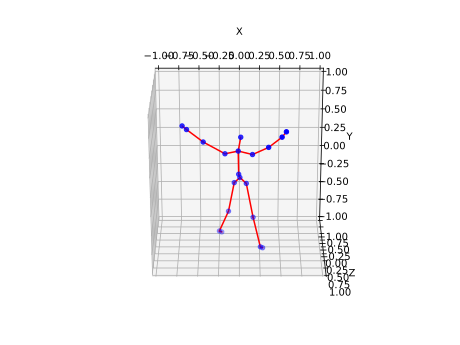

# Dataset Description

## Overview

This repository contains a dataset curated for Human activity analysis. The dataset is designed to support activity Discovery and recognition research and focuses on human activity recognition using Kinect. It includes a diverse collection of skeleton data that spans 17 activities performed by 4 subjects. The dataset details are as follows:

- **Number of Subjects:** 4
- **Total Activities:** 17
- **Number of Skeleton Joints:** 20
- **Kinect Version:** Kinect v1




### Key Files

- **[plot_skeleton.py](plot_skeleton.py):** This script can be used to visualize the skeleton joints and their movements.
- **[display_skeleton.md](display_skeleton.md):** Details on display skeleton  

### Required libraries 

- numpy
- matplotlib
- mpl_toolkits

### Folder Naming
s = subject
a = activity

- **Example:** a folder name s01_a10 means subject 01 activity 10.

### List of Activities

1. Standing
2. Raise Right Hand
3. Raise Left Hand
4. Kick Right Leg
5. Kick Left Leg
6. Waving Right Hand
7. Waving Left Hand
8. Jumping Jacks
9. Walking
10. Sitting Down
11. Seated
12. Standing Up
13. Phone Call
14. Drinking
15. Pickup
16. Sitting and Reading Book
17. Use Broom

### Joint IDs

- `Hip Center`: 0
- `Spine`: 1
- `Shoulder Center`: 2
- `Head`: 3
- `Shoulder Left`: 4
- `Elbow Left`: 5
- `Wrist Left`: 6
- `Hand Left`: 7
- `Shoulder Right`: 8
- `Elbow Right`: 9
- `Wrist Right`: 10
- `Hand Right`: 11
- `Hip Left`: 12
- `Knee Left`: 13
- `Ankle Left`: 14
- `Foot Left`: 15
- `Hip Right`: 16
- `Knee Right`: 17
- `Ankle Right`: 18
- `Foot Right`: 19

We encourage users to explore the dataset and leverage the provided script for visualizing skeleton joints. If you have any questions or need further assistance, feel free to contact us.

## Contents

The dataset is organized into the following folders:

- **Annotations**: Contains [description of annotation files, if applicable].
- **Metadata**: Includes [information about the dataset, such as source, collection date, etc.].
- **Other folders**: [Any additional folders and their contents].

## Note on Image Data

The RGB and Depth images, each exceeding 10GB in size, have been excluded from the repository to maintain a manageable repository size. However, these images are available upon request. If you require access to the RGB and Depth images, please send an email to email2amran@gmail.com, stating your purpose and details of your project.

## Citation

If you use this dataset in your research or work, please cite it using the following format:


```
@inproceedings{hossen2022investigation,
  title={Investigation of the Unsupervised Machine Learning Techniques for Human Activity Discovery},
  author={Hossen, Md Amran and Ong, Wee Hong and Caesarendra, Wahyu},
  booktitle={2021 International Conference on Electronics, Biomedical Engineering, and Health Informatics (ICEBEHI2021)},
  year={2022}
}
```

## License

The dataset is provided under the GPL-3.0 license.

## Contact

For any inquiries or access to the excluded RGB and Depth images, please contact us at email2amran@gmail.com

We appreciate your interest in our dataset and hope it proves valuable for your research or project.